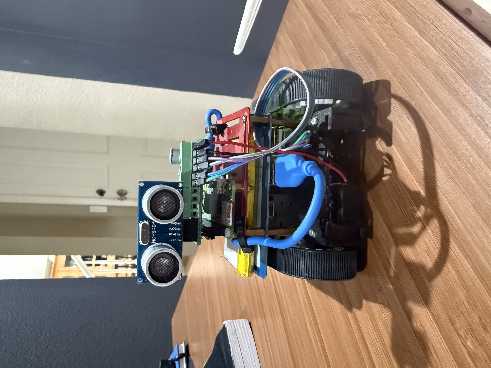
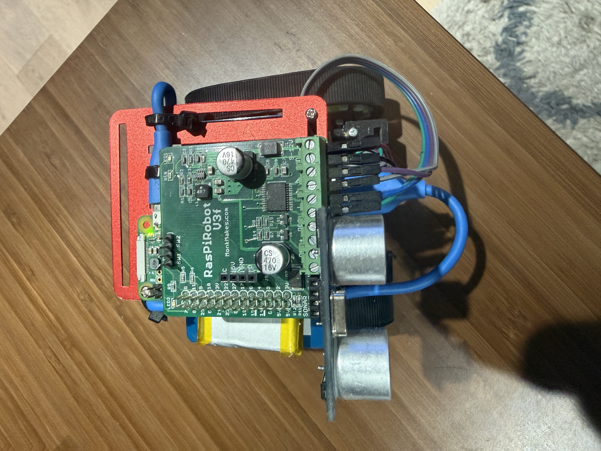
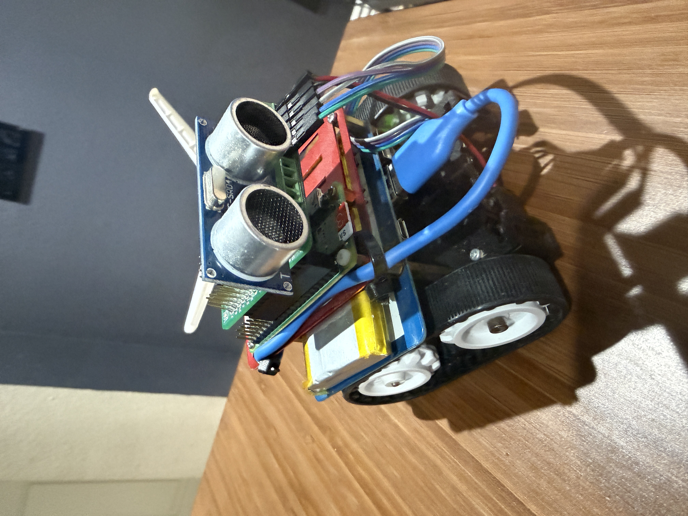
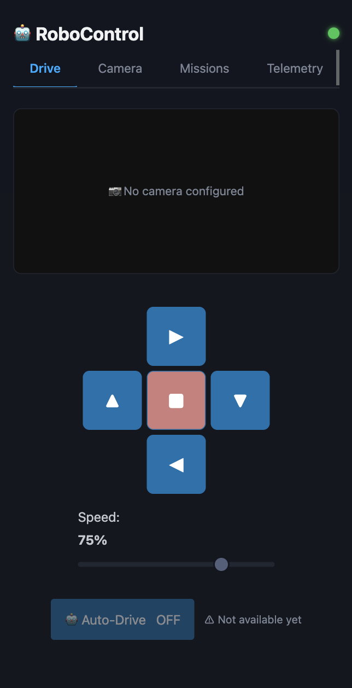
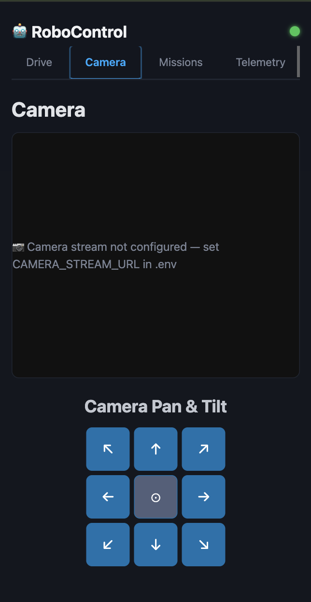
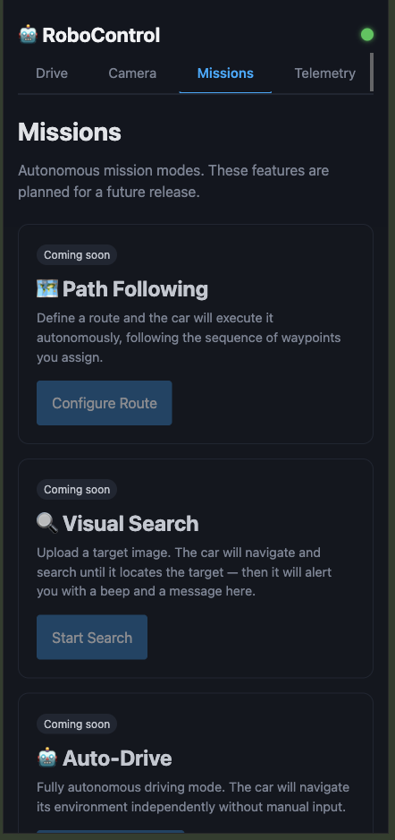
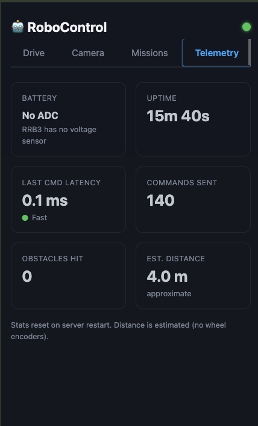

# RoboControl


Control a Raspberry Pi robot car from any browser — no app, no cables, no soldering beyond the motor board.

---

## Gallery

| Front | Top | Angle |
| :---: | :---: | :---: |
|  |  |  |

---

## Table of Contents

1. [What You Need](#1-what-you-need)
2. [Install](#2-install)
3. [First Login](#3-first-login)
4. [Using the Controller](#4-using-the-controller)
5. [Internet Access — Optional](#5-internet-access--optional)
6. [Day-to-day Commands](#6-day-to-day-commands)
7. [Configuration Reference](#7-configuration-reference)
8. [API Reference](#8-api-reference)
9. [Security](#9-security)
10. [Monitoring](#10-monitoring)
11. [Developer Guide](#11-developer-guide)

---

## 1. What You Need

### Required

| Part | Details |
| ---- | ------- |
| Raspberry Pi 3B+ or 4 | Any RAM size |
| RaspiRobot Board V3 (RRB3) | Motor driver HAT — plugs directly onto the GPIO header |
| HC-SR04 ultrasonic sensor | Plugs into the RRB3 sonar header |
| 2× DC gear motors + chassis | Any TT-motor compatible pair |
| 7.4V LiPo battery (2S) | Powers the motors via the RRB3 |
| MicroSD card (16 GB+) | For Raspberry Pi OS |

### Optional

| Part | What it adds |
| ---- | ------------ |
| Pi Camera Module (CSI) or USB webcam | Live video stream while driving |
| 2× SG90 servos + pan/tilt bracket | Aim the camera remotely |
| Passive buzzer | Audio alerts on obstacles |

### Wiring at a glance

```text
Raspberry Pi GPIO header
        │
  RaspiRobot Board V3
  ├── Motor A terminals  → Left motor
  ├── Motor B terminals  → Right motor
  ├── Sonar header       → HC-SR04
  └── Power input        → 7.4V LiPo

GPIO 12 → Pan servo
GPIO 13 → Tilt servo
GPIO 18 → Buzzer
CSI     → Pi Camera ribbon   (if using)
USB     → USB webcam         (if using)
```

> Power the Pi from its own micro-USB supply. Sharing power with the motors causes reboots.

---

## 2. Install

### Step 1 — Flash the SD card

Download [Raspberry Pi Imager](https://www.raspberrypi.com/software/) and flash **Raspberry Pi OS Lite (64-bit, Bookworm)**. In the imager's advanced settings, enable SSH and set a username/password before writing.

### Step 2 — Boot and connect

Insert the card, power on the Pi, and find its IP address from your router's device list. Then open a terminal:

```bash
ssh pi@<pi-ip-address>
```

### Step 3 — Clone the repo

```bash
git clone https://github.com/ZioGuillo/robocontrol.git ~/robocontrol
cd ~/robocontrol
```

### Step 4 — Create your config file

```bash
cp .env.example .env
```

Generate a secret key and paste it into `.env`:

```bash
python3 -c "import secrets; print(secrets.token_hex(32))"
```

Open `.env` with `nano .env` and set:

```ini
SESSION_SECRET_KEY=<paste the key here>
```

Save and close (`Ctrl+O`, `Enter`, `Ctrl+X`).

### Step 5 — Run the install script

```bash
bash scripts/install.sh
```

This will:

- Create the Python virtual environment and install all dependencies
- Install the camera driver (`picamera2`) if available
- Register and start the `robocontrol` systemd service (auto-starts on every boot)

At the end you will see something like:

```text
  Local URL  : http://192.168.x.x:8000
  Public URL : not configured (local-only mode)
```

### Step 6 — Open the controller

On any device connected to the same WiFi, open a browser and go to:

```text
http://<pi-ip-address>:8000
```

---

## 3. First Login

Default credentials:

| Username | Password |
| -------- | -------- |
| `admin` | `admin` |

**Change the password immediately** — go to the **Settings tab → Change password**.

---

## 4. Using the Controller

### Drive tab



| Control | What it does |
| ------- | ------------ |
| Camera preview | Live stream while you drive |
| D-pad | Forward / reverse / turn left / turn right / stop (red centre) |
| Speed slider | Motor power 0–100% (default 75%) |

When the sonar detects an obstacle closer than 20 cm, the car stops automatically and the UI shows a warning.

### Camera tab



Full-size live stream. The 3×3 grid below it nudges the pan/tilt servos; the centre button re-centres both.

Detection order: **CSI camera → USB webcam → `CAMERA_STREAM_URL` → placeholder image**.

### Missions tab



| Mission | Description |
| ------- | ----------- |
| Path Following | Drive a pre-defined waypoint route automatically |
| Visual Search | Roam until the camera finds a target image, then alert |
| Auto-Drive | Free-roam with sonar-based obstacle avoidance |

All missions are currently **coming soon**.

### Telemetry tab



Live stats for the current session (resets on restart):

| Metric | Description |
| ------ | ----------- |
| Battery | Voltage from the RRB3 ADC |
| Uptime | Time since the server started |
| Last CMD Latency | Round-trip time of the last motor command |
| Commands Sent | Total motor commands this session |
| Obstacles Hit | Times the sonar triggered an automatic stop |
| Est. Distance | Approximate distance driven |

### Settings tab *(admin only)*

- **User management** — approve or revoke GitHub OAuth users
- **GitHub OAuth** — paste your GitHub app credentials to enable social login
- **Change password** — update the admin password

---

## 5. Internet Access — Optional

By default the rover is only reachable on your local network. This section is for when you want to control it **from anywhere in the world** using a permanent public URL like `https://rover01.yourdomain.com`.

> Skip this entirely if local control is enough — the rover works fine without it.

### What you need

- A free [Cloudflare account](https://cloudflare.com)
- A domain added to that account (works with any registrar)

### How it works

The install script runs `cloudflared_provision.py` which:

1. Reads your Cloudflare credentials
2. Auto-detects your domain (or you can specify one)
3. Creates a tunnel and assigns the next free `roverXX` subdomain
4. Adds the DNS record automatically
5. Saves everything — the tunnel starts on every boot from then on

### Setup

**On your computer** — create a `cloudflared.env` file:

```ini
CF_API_TOKEN=your_cloudflare_api_token
CF_ACCOUNT_ID=your_cloudflare_account_id

# Optional — auto-detected if omitted
# CF_ZONE_ID=your_zone_id
# CF_ZONE_NAME=mydomain.com
```

| Variable | Required | Where to find it |
| -------- | :------: | ---------------- |
| `CF_API_TOKEN` | Yes | Dashboard → My Profile → API Tokens → Create Token. Permissions: **Tunnel:Edit + DNS:Edit + Zone:Read** |
| `CF_ACCOUNT_ID` | Yes | Dashboard → any domain page → right sidebar |
| `CF_ZONE_ID` | No | Dashboard → your domain → right sidebar. Auto-detected if omitted. |
| `CF_ZONE_NAME` | No | e.g. `mydomain.com`. Picks a specific domain when your account has more than one. |

**Recommended — encrypt the file before putting it on the SD card:**

```bash
# On your Mac / Linux machine:
bash scripts/encrypt_env.sh cloudflared.env
# → produces cloudflared.env.enc  (safe to share)
```

Copy `cloudflared.env.enc` to the SD card boot partition (`/boot/firmware/`). Then add the passphrase to `~/robocontrol/.env` on the Pi:

```ini
CLOUDFLARED_ENV_PASSPHRASE=<the passphrase you chose>
```

If you prefer plain text (trusted environment only), place `cloudflared.env` directly on the boot partition and skip the passphrase step.

**Run provisioning:**

```bash
python3 scripts/cloudflared_provision.py
```

On success:

```text
============================================================
  rover01 is LIVE
============================================================

  Public URL : https://rover01.yourdomain.com
  Local URL  : http://192.168.x.x:8000
```

### Rover numbering

The script queries your Cloudflare account for existing `roverXX` tunnels and picks the first free slot. Rover01 already set up? The next one becomes rover02 automatically.

### Adding a second rover on a different WiFi

Place a `wifi.txt` file on the boot partition before the first boot:

```ini
SSID=NetworkName
PASSWORD=NetworkPassword
```

The file is deleted automatically after the first successful connection.

To connect to a different network later, drop a new `wifi.txt` on the boot partition and reboot.

### Service startup order

```text
wifi-provision             ← connects WiFi from wifi.txt (skipped if absent)
        ↓
cloudflared-provision      ← provisions tunnel (skipped if no credentials or already done)
        ↓
cloudflared                ← tunnel is live
        ↓
robocontrol                ← app is live at :8000 regardless of tunnel
```

### Checking status

```bash
journalctl -u wifi-provision -n 20          # WiFi provisioning log
journalctl -u cloudflared-provision -n 20   # Tunnel provisioning log
sudo systemctl status cloudflared           # Tunnel runtime status
journalctl -u robocontrol -f                # App live logs
```

### Re-provisioning (fresh start)

```bash
rm ~/.cloudflared/config.yml ~/.cloudflared/rover_id ~/.cloudflared/rover_url
sudo systemctl restart cloudflared-provision
```

### GitHub OAuth

To let team members log in with their GitHub accounts:

1. Go to **GitHub → Settings → Developer Settings → OAuth Apps → New OAuth App**
2. Set the callback URL to `https://rover01.yourdomain.com/auth/callback`
3. Copy the **Client ID** and generate a **Client Secret**
4. In RoboControl: **Settings tab → GitHub OAuth** — paste and enable
5. Set `BASE_URL=https://rover01.yourdomain.com` in `.env` so redirects match

New GitHub users land in `pending` until you approve them in the Settings tab.

---

## 6. Day-to-day Commands

### On the Pi

```bash
sudo systemctl status robocontrol    # is it running?
sudo systemctl restart robocontrol   # restart after a config change
journalctl -u robocontrol -f         # live logs
journalctl -u robocontrol -n 50      # last 50 lines
```

### From your computer (Makefile)

```bash
make help                            # list all commands
make deploy                          # push latest code to Pi and restart
make restart                         # restart without deploying
make logs                            # stream live logs
make status                          # check if running
make open                            # open the web UI in your browser
make connect                         # SSH into the Pi
make set-password ADMIN_PASS=NewPass # change admin password
```

Override the Pi address for one command:

```bash
make deploy PI_HOST=pi@192.168.1.50
```

---

## 7. Configuration Reference

All settings live in `~/robocontrol/.env`:

| Variable | Default | Description |
| -------- | ------- | ----------- |
| `SESSION_SECRET_KEY` | *(required)* | Signs session cookies — 32+ random chars |
| `PORT` | `8000` | HTTP port |
| `BASE_URL` | *(empty)* | Public URL when behind Cloudflare or a proxy — required for GitHub OAuth |
| `CAMERA_STREAM_URL` | *(empty)* | Fallback MJPEG URL if no local camera is detected |
| `MOTOR_SPEED_DEFAULT` | `0.75` | Default motor power (0.0–1.0) |
| `OBSTACLE_THRESHOLD_CM` | `20` | Sonar distance (cm) that triggers auto-stop |
| `PAN_SERVO_PIN` | `12` | GPIO pin for pan servo |
| `TILT_SERVO_PIN` | `13` | GPIO pin for tilt servo |
| `BUZZER_PIN` | `18` | GPIO pin for buzzer |
| `MOTOR_RATE_LIMIT` | `20` | Max motor commands/second per IP (0 = unlimited) |
| `CLOUDFLARED_ENV_PASSPHRASE` | *(empty)* | Decrypts `cloudflared.env.enc` on the boot partition |
| `CF_API_TOKEN` | *(empty)* | Cloudflare API token — leave blank for local-only |
| `CF_ACCOUNT_ID` | *(empty)* | Cloudflare Account ID |
| `CF_ZONE_ID` | *(empty)* | Zone ID — auto-detected if omitted |
| `CF_ZONE_NAME` | *(empty)* | Domain name — selects a zone when account has multiple |

---

## 8. API Reference

| Method | Path | Auth | Description |
| ------ | ---- | :--: | ----------- |
| `GET` | `/api/ping` | — | Liveness check — returns `{"ok": true}` |
| `GET` | `/api/status` | Yes | Hardware availability (motors, camera, servos) |
| `GET` | `/api/camera/stream` | Yes | Live MJPEG stream |
| `POST` | `/api/camera/{action}` | Yes | Pan/tilt: `up` `down` `left` `right` `center` |
| `POST` | `/api/motors/{action}` | Yes | `forward` `reverse` `left` `right` `stop` |
| `POST` | `/api/motors/auto` | Yes | Not implemented (501) |
| `POST` | `/api/missions/path` | Yes | Not implemented (501) |
| `POST` | `/api/missions/search` | Yes | Not implemented (501) |

Motor commands accept an optional body: `{"speed": 0.75}` (0.0–1.0).

---

## 9. Security

RoboControl's security model is inspired by the frameworks used at **NASA Jet Propulsion Laboratory (JPL)** for mission-critical systems — the same principles that govern the software controlling the Perseverance rover on Mars.

| Standard | What it covers | Applied in RoboControl |
| -------- | -------------- | ---------------------- |
| **NASA NPR 2810.1** | IT Security policy for all NASA systems | Auth, session management, config hygiene |
| **JPL ICPS** | Institutional Computing Protection Standard — least privilege, strong auth, encryption in transit | RBAC roles, HTTPS via Cloudflare TLS, bcrypt passwords |
| **NIST SP 800-53 Rev 5** | Federal security controls (AC · IA · AU · SC · SI · CM) | Rate limiting, audit logging, input validation, secrets in `.env` |
| **OWASP Top 10** | Web application vulnerability baseline | Parameterized SQL, no path traversal, session cookie flags |

Controls implemented:

- **AC — Access Control** — session tokens signed with `itsdangerous`, roles: `admin / approved / pending / revoked`
- **IA — Authentication** — bcrypt password hashing, GitHub OAuth 2.0, 14-day token expiry, forced first-login password change
- **AU — Audit** — all HTTP requests logged by uvicorn; obstacles, commands and telemetry stored in SQLite
- **SC — System Protection** — HTTPS via Cloudflare Tunnel, rate limiting on login (5 req/s) and motor commands (configurable)
- **SI — Input Integrity** — Pydantic validation on all API inputs, parameterized SQL throughout `app/db.py`
- **CM — Config Management** — secrets in `.env` (never in source), systemd service isolation

> "Same mission, different budget." — Perseverance cost $2.75 billion and has a dedicated security team. RoboControl costs ~$100 and is maintained by one person. The security principles are the same.

---

## 10. Monitoring

RoboControl exports a Prometheus-compatible `/metrics` endpoint that any Prometheus server can scrape.

```
GET http://<pi-ip>:8000/metrics
```

The path requires no authentication so Prometheus can scrape without a session token.
Metrics are refreshed every **5 seconds** by the background telemetry thread.

### Scrape config

```yaml
scrape_configs:
  - job_name: robocar
    static_configs:
      - targets: ['<pi-ip>:8000']
    metrics_path: /metrics
    scrape_interval: 5s
```

### Metrics reference

| Category | Metric | Type | Description |
| -------- | ------ | ---- | ----------- |
| **System** | `robocar_cpu_percent` | Gauge | CPU usage (0–100) |
| | `robocar_cpu_temperature_celsius` | Gauge | SoC temperature in °C (Pi only — 0 on other hw) |
| | `robocar_ram_used_bytes` | Gauge | RAM used in bytes |
| | `robocar_ram_total_bytes` | Gauge | Total RAM in bytes |
| | `robocar_disk_used_bytes` | Gauge | Disk used bytes (/) |
| | `robocar_disk_total_bytes` | Gauge | Disk total bytes (/) |
| | `robocar_uptime_seconds` | Gauge | Server uptime in seconds |
| **Hardware** | `robocar_hardware_available{component}` | Gauge | Component status — 1=up, 0=down; labels: `motors`, `camera`, `servo` |
| **Motors** | `robocar_motor_commands_total{action}` | Counter | Motor commands dispatched; labels: `forward`, `reverse`, `left`, `right`, `stop` |
| | `robocar_motor_blocked_total` | Counter | Forward commands blocked by obstacle detection |
| | `robocar_estimated_distance_meters` | Gauge | Estimated distance driven this session in meters |
| **Sensor** | `robocar_sonar_distance_cm` | Gauge | Last ultrasonic reading in cm (0 = no reading yet) |
| | `robocar_obstacles_total` | Counter | Obstacle detections triggering auto-stop |
| **Camera** | `robocar_camera_frames_total` | Counter | MJPEG frames captured by the camera driver |
| **HTTP** | `robocar_http_requests_total{method,path,status}` | Counter | HTTP requests handled |
| | `robocar_http_request_duration_seconds{path}` | Histogram | Request latency; buckets 5 ms → 2.5 s |
| **Auth** | `robocar_login_attempts_total{result}` | Counter | Login attempts; labels: `success`, `failure` |
| | `robocar_rate_limit_hits_total{endpoint}` | Counter | Rate limit rejections; labels: `login`, `motors` |
| | `robocar_active_sessions_total` | Gauge | Currently active (non-expired) user sessions |
| **Build** | `robocar_build_info` | Info | Static labels: `version="2.0"`, `hardware="rpi4"` |

### Grafana PromQL examples

```promql
# CPU usage live
robocar_cpu_percent

# HTTP request rate (last 5 min)
rate(robocar_http_requests_total[5m])

# P95 request latency
histogram_quantile(0.95, rate(robocar_http_request_duration_seconds_bucket[5m]))

# Motor command breakdown
rate(robocar_motor_commands_total[5m])

# Obstacle detection rate
rate(robocar_obstacles_total[5m])

# Active sessions
robocar_active_sessions_total
```

All metric definitions live in `app/metrics.py`. The `/metrics` route is registered in `app/main.py`.

---

## 11. Developer Guide

### Enabling the Pi Camera (CSI)

```bash
sudo apt install -y python3-picamera2
sudo raspi-config nonint do_camera 0
sudo reboot
```

USB webcams work out of the box — just plug in and restart the service.

### Adding a new route

The app uses **route auto-discovery** — drop a new file in `app/routes/` and it's live on restart, no changes to `main.py` needed.

```bash
cp app/routes/_template.py app/routes/lights.py
# edit lights.py: set prefix and add endpoints
sudo systemctl restart robocontrol
```

```text
app/routes/
├── _template.py    ← start here
├── camera.py
├── missions.py
├── motors.py
├── settings.py
├── status.py
└── telemetry.py
```

### Hardware helpers

```python
from app.hardware import rrb3_driver    # set_motors(), get_distance(), available
from app.hardware import servo_driver   # move(), center(), available
from app.hardware import camera_driver  # get_frame(), start(), stop(), available
from app.config import settings         # all .env values
from app import telemetry               # record_command()
```

### Running tests

No hardware required — drivers degrade gracefully when GPIO/rrb3/picamera2 are unavailable:

```bash
pytest -v
```

### Swapping hardware

Only `app/hardware/` is hardware-specific. Everything else is agnostic.

**Alternative boards:**

| Board | Change |
| ----- | ------ |
| NVIDIA Jetson Nano | Swap `RPi.GPIO` → `Jetson.GPIO` |
| Orange Pi / Banana Pi | Use `OPi.GPIO` or `wiringOP` |
| BeagleBone Black | Use `Adafruit_BBIO` |

**Alternative motor drivers:**

| Driver | Notes |
| ------ | ----- |
| L298N | Direct `RPi.GPIO` PWM — no extra library |
| Adafruit Motor HAT | `adafruit-circuitpython-motorkit` |
| Cytron MDD3A / MDD10A | PWM + direction pins, same pattern as L298N |

**Sensors and extras:**

| Component | Library |
| --------- | ------- |
| Encoder wheels | `RPi.GPIO` interrupt — accurate odometry |
| IMU (MPU-6050) | `mpu6050-raspberrypi` |
| LIDAR (RPLidar A1) | `rplidar-roboticia` — 2D mapping |
| NeoPixel LEDs | `rpi_ws281x` |
| GPS module | `gpsd` + `gps3` |

### Future implementations

- Auto-drive — obstacle avoidance free-roam
- Path following — execute a waypoint route
- Visual search — roam until the camera matches a target image
- Buzzer feedback — audio confirmation for commands
- Light control — toggle RRB3 onboard LEDs
- Battery monitoring — live voltage display
